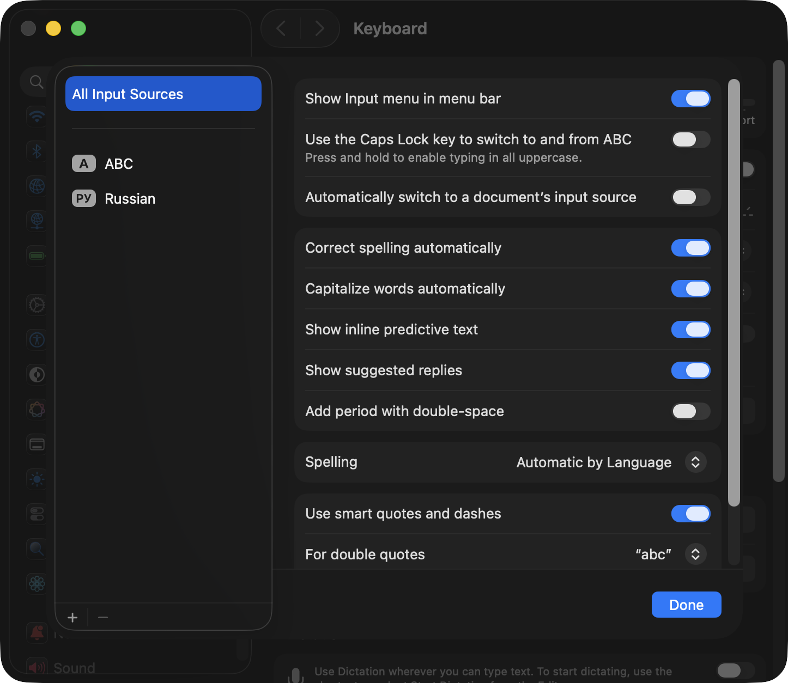
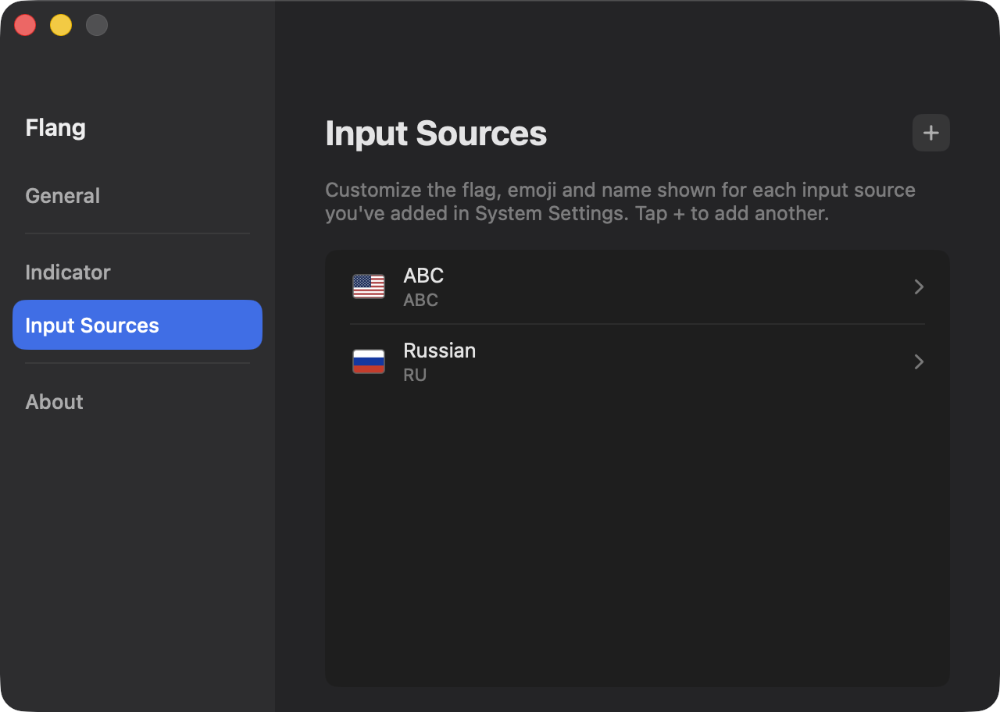

# Flang

**Bring country flags back to the macOS input source switcher.**

<!-- Language switcher — uncomment as translations appear in docs/readme/
English | [Español](docs/readme/README.es.md) | [Français](docs/readme/README.fr.md) | [Português](docs/readme/README.pt-BR.md) | [中文](docs/readme/README.zh-Hans.md) | [日本語](docs/readme/README.ja.md) | [Русский](docs/readme/README.ru.md)
-->

Until macOS 12.4, the keyboard layout switcher in the menu bar showed a country
flag. Apple then replaced the flags with plain text labels ("ABC", "ES").
Flang is a small menu bar app that brings the flags back — and lets you decide
which flag, and which name, represents each of your languages.

> **Work in progress.** Flang is under active development and has not reached
> its first stable release yet. See the [roadmap](#roadmap).

<!-- TODO: screenshot / GIF of the menu bar switcher here -->

## Features

| | |
|---|---|
| Flag in the menu bar | Current input source shown with its flag, updated instantly |
| Familiar switching | Click to see all your input sources and switch, just like the system menu |
| Flexible indicator | Flag and name shown independently — either, both, or neither (falls back to the system icon) |
| Two flag looks | Flat flag images (the classic look) or native emoji flags |
| Sensible defaults | Every macOS keyboard layout and input method gets a reasonable default flag |
| Full personalization | Any flag, custom short name and custom full name for every language |
| Minimal footprint | No data collection, starts at login, a few megabytes; the only network call is an optional daily update check |

Languages are not tied to countries — that is exactly why Flang makes the flag
a personal choice. Prefer the Canadian flag for French, or the Mexican flag for
Spanish? Two clicks.

## Installation

Flang is not released yet. To try the development version:

```bash
git clone https://github.com/e1ernal/Flang.git
open Flang/Flang.xcodeproj
```

Build and run with Cmd+R (Xcode 16 or newer, macOS 13 Ventura or newer).

## Usage

1. Launch Flang — a flag appears in your menu bar.
2. Click it to switch input sources; right-click for Settings and Quit.
3. Optional: hide the built-in system switcher in
   System Settings — Keyboard — uncheck "Show Input menu in menu bar".
   macOS does not allow apps to do this automatically, so it is a one-time
   manual step.

   

4. To add or remove a keyboard layout, open Settings — Input Sources and use
   the "+" button (or Delete on a source) — both hand off to System
   Settings — Keyboard — Input Sources, where macOS handles it directly.

   

## FAQ

**Does Flang replace the system switcher?**
Functionally yes: it lists and switches the same input sources using the same
system APIs. The system's own indicator can only be hidden manually (see Usage).

**Does Flang need the internet?**
No. The only optional network call is a daily check for new versions on GitHub.
Nothing about you or your system is ever sent anywhere.

## Roadmap

- [x] Menu bar indicator with a flag for the current input source
- [x] Switch input sources from the dropdown menu
- [x] Default flag map for all macOS layouts and input methods
- [x] Image and emoji flag modes
- [x] Independent flag and name display settings, with live preview
- [x] Settings window: custom flag, short and full name per language
- [x] Start at login, first-launch tips
- [x] Update check against GitHub Releases
- [x] Interface localized in EN and RU
- [ ] DMG releases with built-in update notifications
- [ ] Localized README (ES, FR, JA, PT-BR, ZH-Hans)
- [ ] Signed builds and automatic updates

## Contributing

Issues and pull requests are welcome.

## Credits and License

| | |
|---|---|
| Flag images | [flag-icons](https://github.com/lipis/flag-icons) by lipis, MIT License |
| Flang | Released under the [MIT License](LICENSE) |
